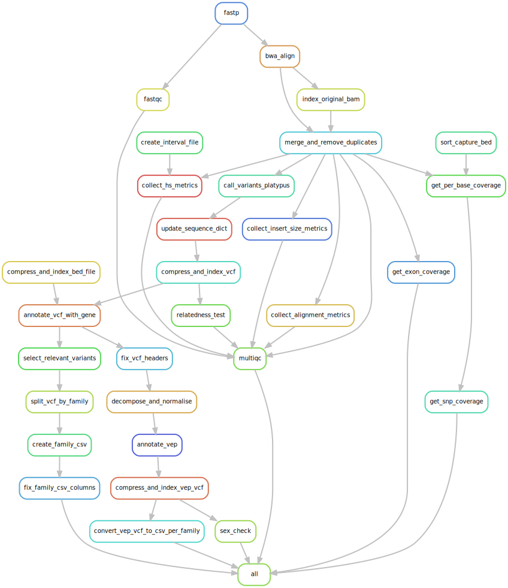

# Non-Invasive Prenatal Diagnosis Bioinformatics Pipeline

## Introduction

A pipeline to conduct Non-Invasive Prenatal Diagnosis for X linked and Autosomal Reccessive disorders.



## Installation

The pipeline is designed to run on the Linux (Centos) and Mac OS operating systems.

The pipeline is designed to be run within a Conda environment. Complete the following steps to install all dependencies:

1) Install Miniconda from (https://conda.io/miniconda.html).

2) Clone and enter repository:

```
git clone https://github.com/AWGL/NIPD.git
cd NIPD

```

3) Create a conda environment:

`conda env create -f envs/main.yaml`

4) Activate the environment:

`source activate nipd`

## Configuration

The pipeline is configured using a YAML file. By convention these files are stored in the config/ directory.

Example configuration files are provided. The family structure of the samples should be specified in the config file. For example:

```
families:

  FAM001:
    analysis_required: X-linked
    members:
      mother: maternal_sample_id 
      plasma: ff_plasma_sample_id
      proband: proband_sample_id
      father: paternal_sample_id

  FAM002:
    analysis_required: X-linked
    members:
      mother: maternal_sample_id 
      plasma: ff_plasma_sample_id
      proband: proband_sample_id
      father: null

```

The input for the pipeline should be in the following structure:

```
Snakefile
config
utils
envs
config.yaml
sample1/
	-sample1_S1_L001_R1_001.fastq.gz
	-sample1_S1_L001_R2_001.fastq.gz
	-sample1_S1_L002_R1_001.fastq.gz
	-sample1_S1_L002_R2_001.fastq.gz
	-sample1_S1_L00n_R1_001.fastq.gz
	-sample1_S1_L00n_R2_001.fastq.gz
sample2/
	-sample2_S2_L001_R1_001.fastq.gz
	-sample2_S2_L001_R2_001.fastq.gz
	-sample2_S2_L002_R1_001.fastq.gz
	-sample2_S2_L002_R2_001.fastq.gz
	-sample2_S2_L00n_R1_001.fastq.gz
	-sample2_S2_L00n_R2_001.fastq.gz
```


## Run Pipeline

To run locally cd into the directory containing the script and enter the following commands:

```
source activate nipd

snakemake -p

```

To run on cluster enter the following command:

```

source activate nipd

mkdir logs

snakemake -p --jobs $NUMBER_OF_JOBS --cluster "qsub -V -o $STD_OUT_LOG_DIR -e $STD_ERROR_LOG_DIR -l ncpus=12 -l walltime=12:00:00  -d $DATA_DIR" --directory /share/data/results/181129_NB551415_0005_AHWW37BGX7/NIPD1/ -s DATA_DIR/Snakefile --use-conda

```

All paths should be absolute rather than relative.

For example

```

source activate nipd

mkdir logs

snakemake -p --jobs 12 --cluster "qsub -V -o /share/data/results/181129_NB551415_0005_AHWW37BGX7/NIPD1/logs -e /share/data/results/181129_NB551415_0005_AHWW37BGX7/NIPD1/logs -l ncpus=12 -l walltime=12:00:00  -d /share/data/results/181129_NB551415_0005_AHWW37BGX7/NIPD1/" --directory /share/data/results/181129_NB551415_0005_AHWW37BGX7/NIPD1/ -s /share/data/results/181129_NB551415_0005_AHWW37BGX7/NIPD1/Snakefile --use-conda

```

## Analyse Data

The data can be analysed using the NIPDToolkit python package contained within the utils directory. The Jupyter Notebook run_analysis.ipynb will run the analysis code on the SNP data generated by the pipeline. 

## Trouble Shooting

* Directories on non-head nodes have different paths to the data directory - path to data directory should be /share/data/ not /state/partition1/data

* Conda installed Picard can't find the correct Java - all Picard commands should be prefixed with  `export JAVA_HOME=$JAVA_HOME;`


